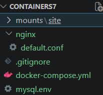
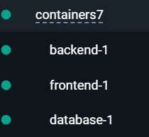

# Лабораторная работа №7  

## Создание многоконтейнерного приложения

## Цель работы

Разобраться, как работает многоконтейнерное приложение с использованием docker-compose.

## Задание

Собрать PHP-приложение из трёх контейнеров:

- nginx
- php-fpm
- mysql

## Ход работы

### 1. Подготовка проекта

Создал репозиторий `containers07` и скопировал его к себе на компьютер.

Структура проекта:



### 2. Сайт на PHP

Создал папку:

```bash
mounts/site
```

И закинул туда свой сайт на PHP с прошлой лабораторной.

### 3. .gitignore

Создал файл `.gitignore`:

```
gitignore
mounts/site/-
```

Чтобы не загружать сайт в репозиторий.

### 4. Конфиг nginx

Создал файл `nginx/default.conf`:

```nginx
server {
    listen 80;
    server_name _;
    root /var/www/html;
    index index.php;

    location / {
        try_files $uri $uri/ /index.php?$args;
    }

    location ~ \.php$ {
        fastcgi_pass backend:9000;
        fastcgi_index index.php;
        fastcgi_param SCRIPT_FILENAME $document_root$fastcgi_script_name;
        include fastcgi_params;
    }
}
```

Смысл:

- nginx принимает запросы
- если это PHP — отправляет в контейнер `backend`

### 5. docker-compose.yml

```yaml
version: '3.9'

services:
  frontend:
    image: nginx:1.19
    volumes:
      - ./mounts/site:/var/www/html
      - ./nginx/default.conf:/etc/nginx/conf.d/default.conf
    ports:
      - "80:80"
    networks:
      - internal

  backend:
    image: php:8.4-fpm
    volumes:
      - ./mounts/site:/var/www/html
    networks:
      - internal
    env_file:
      - mysql.env

  database:
    image: mysql:8.0
    env_file:
      - mysql.env
    networks:
      - internal
    volumes:
      - db_data:/var/lib/mysql

networks:
  internal: {}

volumes:
  db_data: {}
```

Разделение:

- `frontend` — nginx (входная точка)
- `backend` — php-fpm (исполняет код)
- `database` — база данных

### 6. mysql.env

```env
MYSQL_ROOT_PASSWORD=secret
MYSQL_DATABASE=app
MYSQL_USER=user
MYSQL_PASSWORD=secret
```

### 7. Запуск

```bash
docker-compose up -d
```

Проверка:

```bash
http://localhost
```

Если открывается дефолтная страница nginx — просто обновить страницу.

## Ответы на вопросы

### 1. В каком порядке запускаются контейнеры?

Порядок запуска контейнеров не определён. Как следствие, отследить порядок загруззки не представляется возможным

### 2. Где хранятся данные базы?

В volume:

```bash
db_data
```

То есть данные не удаляются при перезапуске контейнера.

### 3. Как называются контейнеры?

Сервисы:

- frontend
- backend
- database

Реальные имена примерно такие:



### 4. Как добавить app.env?

Создаём файл:

```env
APP_VERSION=1.0
```

И добавляем в docker-compose:

```yaml
frontend:
  env_file:
    - app.env

backend:
  env_file:
    - mysql.env
    - app.env
```

## Вывод

В этой лабораторной я собрал многоконтейнерное приложение через docker-compose.

Разделил:

- nginx — принимает запросы
- php-fpm — выполняет код
- mysql — хранит данные

Контейнеры связаны через сеть и работают вместе как одно приложение.В целом стало понятно, как строятся реальные проекты на Docker.
